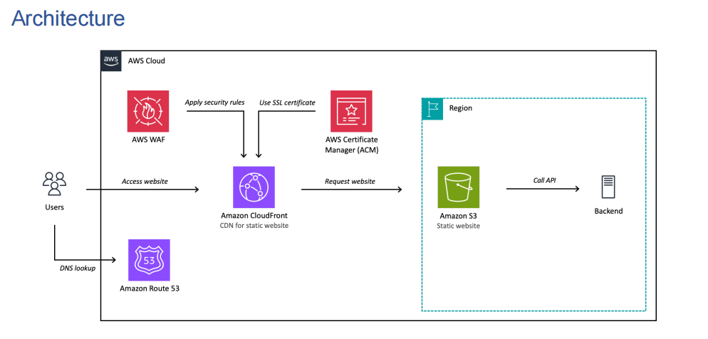

# Static Website on AWS + GCP

This repository contains:
- Terraform for AWS static hosting (`aws/`)
- Terraform for GCP static hosting (`gcp/`)
- A React + Vite SPA app (`site/`)
- A PowerShell deploy script for AWS (`deploy-aws-spa.ps1`)

## Architecture

The following diagram shows the AWS architecture used in this project.



## Deploy React Vite App to AWS S3 + CloudFront (Step by Step)

### 1) Prerequisites

Install and configure:
- Terraform (`terraform --version`)
- AWS CLI (`aws --version`)
- Node.js + npm (`node -v`, `npm -v`)

Authenticate AWS CLI:
- `aws configure`

### 2) Create Route 53 hosted zone (manual)

Because this Terraform setup expects an existing hosted zone ID, create DNS zone first.

1. Open AWS Console -> Route 53 -> Hosted zones
2. Click Create hosted zone
3. Enter your root domain (example: `example.com`)
4. Keep type as Public hosted zone, then create
5. Copy the Hosted zone ID (format like `Z123ABC456XYZ`)
6. Copy the 4 NS values from the hosted zone
7. Go to your domain registrar and replace/update nameservers with these Route 53 NS values
8. Wait for DNS delegation to propagate (can take minutes to hours)

### 3) Configure AWS Terraform variables

1. Go to AWS Terraform folder:
   - `cd aws`
2. Create your local variables file from example:
   - `copy terraform.tfvars.example terraform.tfvars`
3. Edit `terraform.tfvars` and set:
   - `domain_name`
   - `site_subdomain`
   - `hosted_zone_id`
   - optional `aws_region`, `project_name`, and `tags`

### 4) Provision AWS infrastructure

From `aws/`:
- `terraform init`
- `terraform plan`
- `terraform apply`

This creates:
- Private S3 bucket
- CloudFront distribution with OAC
- ACM certificate (us-east-1)
- Route53 DNS records

### 5) Get deployment values

After apply, get:
- S3 bucket name (from Terraform output `s3_bucket_name`)
- CloudFront distribution ID (from AWS CloudFront console, or add a Terraform output for it)

### 6) Build the React Vite app

From repo root:
- `npm --prefix site install`
- `npm --prefix site run build`

Build output will be in:
- `site/dist`

### 7) Deploy SPA to S3 and invalidate CloudFront

From repo root, run:

```powershell
.\deploy-aws-spa.ps1 `
  -BucketName "<your-s3-bucket-name>" `
  -DistributionId "<your-cloudfront-distribution-id>" `
  -BuildDir "site/dist" `
  -RunBuild `
  -BuildCommand "npm --prefix site run build"
```

What this script does:
- Uploads `site/dist` to S3
- Sets `index.html` and `404.html` as no-cache (if present)
- Creates CloudFront invalidation for `/` and `/index.html`

### 8) Verify website

Open your domain in browser:
- `https://<site_subdomain>.<domain_name>`
- `https://<domain_name>`

If cert/DNS is still propagating, wait a few minutes and retry.

## Deploy React Vite App to GCP (Step by Step)

### Quick command checklist

Use this if you want the shortest end-to-end flow.

```powershell
# 1) Auth + project
gcloud auth login
gcloud auth application-default login
gcloud config set project YOUR_GCP_PROJECT_ID
gcloud services enable compute.googleapis.com dns.googleapis.com certificatemanager.googleapis.com

# 2) Terraform provision
cd gcp
copy terraform.tfvars.example terraform.tfvars
# edit terraform.tfvars (project_id, project_name, domain_name, site_subdomain, dns_managed_zone)
terraform init
terraform apply

# 3) Build SPA
cd ..
npm --prefix site install
npm --prefix site run build

# 4) Upload build to GCS
gcloud storage rsync .\site\dist gs://YOUR_BUCKET_NAME --recursive --delete-unmatched-destination-objects

# 5) Invalidate CDN cache
cd gcp
gcloud compute url-maps invalidate-cdn-cache YOUR_PROJECT_NAME-https-map --path "/*" --global
```

### 1) Prerequisites

Install and configure:
- Terraform (`terraform --version`)
- Google Cloud SDK (`gcloud --version`)
- Node.js + npm (`node -v`, `npm -v`)

Authenticate to GCP and set project:

```powershell
gcloud auth login
gcloud auth application-default login
gcloud config set project YOUR_GCP_PROJECT_ID
```

Enable required APIs:

```powershell
gcloud services enable compute.googleapis.com dns.googleapis.com certificatemanager.googleapis.com
```

### 2) Create Cloud DNS managed zone (manual)

This Terraform setup expects an existing Cloud DNS managed zone name in `dns_managed_zone`.

1. Open GCP Console -> Network services -> Cloud DNS
2. Create a public managed zone for your root domain (example: `example.com`)
3. Copy the managed zone name (example: `example-com-zone`)
4. Copy the NS records shown by Cloud DNS
5. Update nameservers at your domain registrar to these Cloud DNS NS values
6. Wait for DNS delegation to propagate

### 3) Configure GCP Terraform variables

From repo root:

```powershell
cd gcp
copy terraform.tfvars.example terraform.tfvars
```

Edit `gcp/terraform.tfvars` and set:
- `project_id`
- `project_name`
- `domain_name`
- `site_subdomain`
- `dns_managed_zone`
- optional `region`, `labels`

### 4) Provision GCP infrastructure

From `gcp/`:

```powershell
terraform init
terraform plan
terraform apply
```

This creates:
- GCS bucket for static site
- Backend bucket + Cloud CDN
- HTTPS global load balancer
- Google-managed SSL certificate
- Cloud DNS `A` records for apex and subdomain

Security model:
- End users access content through the HTTPS load balancer.
- Objects are publicly readable in GCS (required for backend bucket pattern).
- CDN and HTTPS load balancer are used for custom domain, TLS, and edge caching.

### 5) Get deployment values

From `gcp/`:

```powershell
terraform output
```

Use:
- `bucket_name` for upload target
- `global_ip_address` for DNS verification
- `site_fqdn` for final URL

### 6) Build the React Vite app

From repo root:

```powershell
npm --prefix site install
npm --prefix site run build
```

Build output will be in:
- `site/dist`

### 7) Upload SPA files to GCS

From repo root:

```powershell
gcloud storage rsync .\site\dist gs://YOUR_BUCKET_NAME --recursive --delete-unmatched-destination-objects
```

This upload command uses your authenticated identity to write objects.
Bucket objects are served publicly through the load balancer/backend bucket architecture.

Optional cache-control optimization:
- Upload `index.html` with no-cache
- Upload hashed assets with long cache

### 8) Invalidate Cloud CDN cache after upload

From `gcp/`, invalidate URL map cache:

```powershell
gcloud compute url-maps invalidate-cdn-cache YOUR_PROJECT_NAME-https-map --path "/*" --global
```

Example: if `project_name = "my-static-site"`, URL map name is `my-static-site-https-map`.

### 9) Verify website

Open:
- `https://<site_subdomain>.<domain_name>`
- `https://<domain_name>`

Notes:
- Google-managed certificate can take some time to become `ACTIVE`
- DNS and cert propagation may require several minutes

### GCP troubleshooting: `allUsers` forbidden by public access prevention

If Terraform fails on:
- `google_storage_bucket_iam_member.public_read`
- with error: `allUsers and allAuthenticatedUsers are not allowed since public access prevention is enforced`

Set this on the bucket resource and re-apply:

```hcl
public_access_prevention = "inherited"
```

Then run:

```powershell
cd gcp
terraform apply
```

## Local development (React Vite)

From repo root:
- `npm --prefix site install`
- `npm --prefix site run dev`

Vite dev server will print the local URL in terminal.

## Destroy provisioned Terraform resources

Use this section when you want to clean up cloud resources created by this repo.

### Before destroy

- Make sure you are in the correct AWS/GCP account and project
- Review what will be deleted with `terraform plan -destroy`
- Keep your `terraform.tfvars` file available (same values used for apply)

### Destroy AWS resources

From repo root:

```powershell
cd aws
terraform init
terraform plan -destroy
terraform destroy
```

Notes:
- This removes resources managed in `aws/` (S3, CloudFront, ACM records, Route53 records created by Terraform)
- The Route 53 hosted zone itself is not created by this Terraform, so it is not destroyed
- If S3 bucket deletion fails because objects remain, empty the bucket and rerun `terraform destroy`

### Troubleshooting: S3 bucket not deleted on `terraform destroy`

If `terraform destroy` fails with `BucketNotEmpty` for a versioned S3 bucket:

1. Empty all object versions and delete markers (not only current objects).
2. Re-run `terraform destroy`.

Why this happens:
- This project enables S3 versioning.
- Even when the bucket looks empty in console, old versions/delete markers can still exist and block deletion.

Fix steps (PowerShell):

```powershell
$ErrorActionPreference = "Stop"
$Bucket = "YOUR_BUCKET_NAME"

do {
  $resp = aws s3api list-object-versions --bucket $Bucket --output json | ConvertFrom-Json

  $objects = @()
  if ($resp.Versions) {
    foreach ($v in $resp.Versions) {
      $objects += [ordered]@{ Key = $v.Key; VersionId = $v.VersionId }
    }
  }
  if ($resp.DeleteMarkers) {
    foreach ($m in $resp.DeleteMarkers) {
      $objects += [ordered]@{ Key = $m.Key; VersionId = $m.VersionId }
    }
  }

  if ($objects.Count -gt 0) {
    $payloadObj = [ordered]@{ Objects = $objects; Quiet = $true }
    $json = $payloadObj | ConvertTo-Json -Depth 10 -Compress
    $tmp  = Join-Path $env:TEMP "s3-delete.json"

    # Write UTF-8 without BOM (avoids AWS CLI JSON parse errors)
    $utf8NoBom = New-Object System.Text.UTF8Encoding($false)
    [System.IO.File]::WriteAllText($tmp, $json, $utf8NoBom)

    aws s3api delete-objects --bucket $Bucket --delete "file://$tmp" | Out-Null
    Write-Host "Deleted $($objects.Count) entries..."
  }
}
while ($objects.Count -gt 0)

Write-Host "Bucket versions/delete markers removed."
```

Then run:

```powershell
cd aws
terraform destroy
```

If bucket still appears after cleanup:
- Run `terraform destroy` one more time.
- Verify there are no remaining versions/delete markers:
  - `aws s3api list-object-versions --bucket YOUR_BUCKET_NAME`
- If needed, delete bucket manually, then remove from state:
  - `aws s3api delete-bucket --bucket YOUR_BUCKET_NAME`
  - `terraform state rm aws_s3_bucket.site`

### Destroy GCP resources

From repo root:

```powershell
cd gcp
terraform init
terraform plan -destroy
terraform destroy
```

If destroy fails because the bucket is not empty (recommended Option A):

```powershell
gcloud storage rm -r "gs://YOUR_BUCKET_NAME/**"
cd gcp
terraform destroy
```

Notes:
- This removes resources managed in `gcp/` (bucket, load balancer resources, DNS records created by Terraform)
- Managed SSL certificate and forwarding rules may take a few minutes to fully delete

### Optional manual cleanup after destroy

- Remove Route 53 hosted zone manually only if you no longer need the domain in AWS DNS
- At your registrar, you can switch nameservers away from Route 53 if required